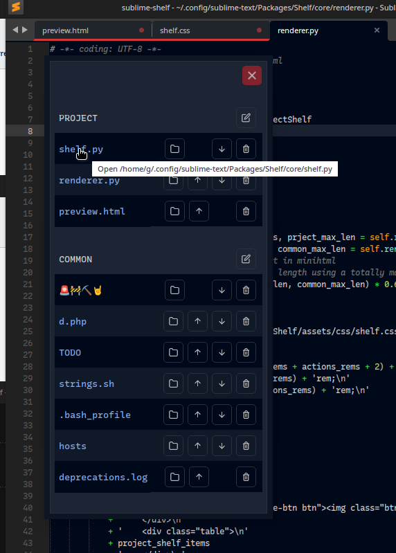

# Shelf

Sublime Text 4 plugin for storing - per project or globally - frequenly used files. Its interface allows viewing/ordering the file lists the file lists and opening the stored file paths or thier containing folders.

*__WARNING__*

This plugin is in pre-alpha state. Keep this in mind if you decide to install/use it.

## Installation

*__Manual__*

_Only available method as yet_

* Remove the package, if installed, using Package Control.
* Add this repository: `https://github.com/the-ge/sublime-shelf.git`
* Install `Shelf` with Package Control.

You can also install the plugin by cloning the `sublime-shelf` repository into your Packages folder or manually placing the downloaded package there.

## Usage

The plugin provides three actions in the Command Palette (Ctrl+Shift+P in Linux) or in the context menu:
1. Add the current file to the project list. Every project can have a shelf file, stored next to its project file (project-name.sublime-project).
2. Add the current file to the common (global) list, stored in the Sublime Text User folder.
3. View the current project shelf and the common shelf. It uses a (mini)HTML popup providing buttons for the following actions (at this time):
    * open the file itself (click on the file name);
    * open the containing folder (click on the folder icon next to the file name);
    * move the file up in the list (click on the up-arrow icon next to the file name);
    * move the file down in the list (click on the down-arrow icon next to the file name);
    * remove the file from the list (click on the trash icon next to the file name);

## Settings

No settings.

The available commands are (see also the `Default.sublime-commands` file):

* View shelf: `{"command": "shelf_view" }`
* Add the current file to the project shelf: `{ "command": "shelf_add", "args": {"shelf": "project"} }`;
* Add the current file to the common shelf: `{ "command": "shelf_add", "args": {"shelf": "common"} }`;
